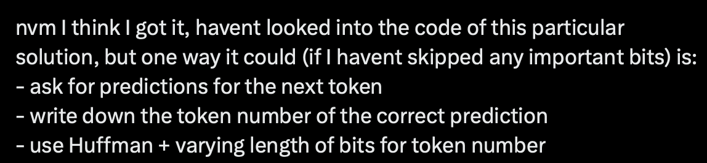

# llm_compressor

Loosely based on https://bellard.org/ts_zip/ -- though I have not downloaded/used/looked at the code of it, and frankly I do not even know if my implementation is the same idea as the author's. I just looked at this single tweet (https://x.com/amasad/status/1874501703984382086), and thought it would be interesting to dig a little into how I thought it could be done (https://x.com/Laz4rz/status/1874510188738208030).

The plan is to:

So we move token-by-token, and check what is the rank of the token we know will come next. Then we save the rank (which intuitively -- though statistics probably can prove that -- will be on average smaller than token number). When we do that for all the tokens, we then run your day-to-day compression algorithm on that.

WIP